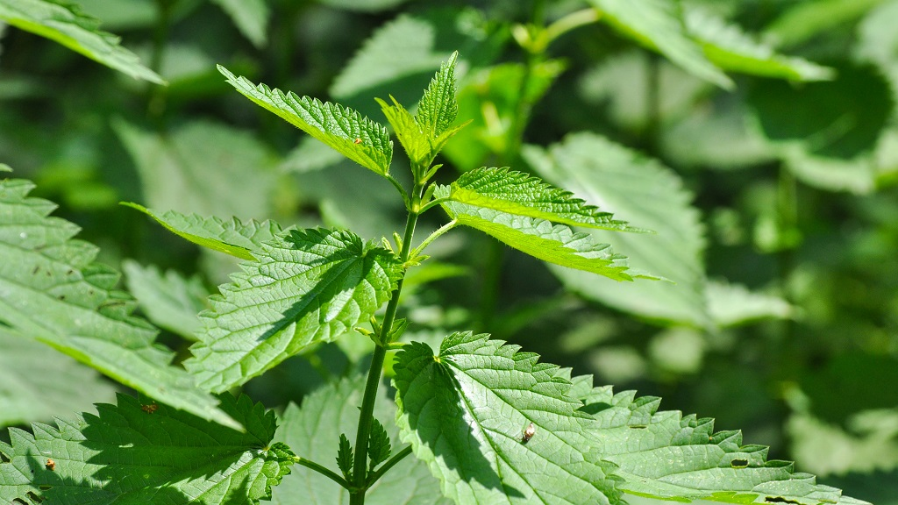
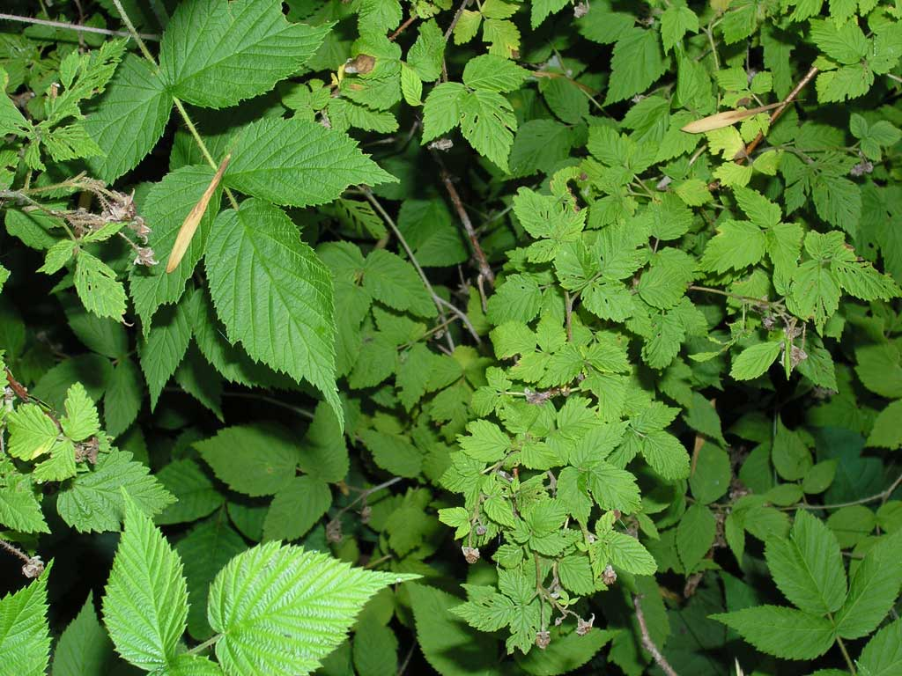

# 🌾🍵 biomenstrual flora 🍵🌾
flora &amp; botanical remedies for menstrual care
by [Nadia](http://nadiacw.com) & [Marie Louise](http://mljuul.com)

### Common nettle / Stinging nettle

Brännässla ⌁ *Urtica dioica*

📍 Worldwide

✅ Local to Nordic ecologies

⚗️ Heavy menstrual bleeding. It's high in iron and its astringent properties make it helpful for the treatment of heavy periods and anaemia. It is also used for stopping bleeding from nose bleeds and wounds. (Reference: *Botanicum Medicinale)*

🍵 Used as a tea, soup

### Red Raspberry leaf

Hallonblad ⌁ *Rubus Idaeus*

📍 Europe and Norther Asia

✅ Local to Nordic ecologies

⚗️ Menstrual cramps. Aid in the last stage of labor. Contains fragarine, a plant compound that helps tone and tighten muscles in the pelvic area, which may reduce the menstrual cramping caused by the spasms of these muscles.

🍵 Used as a tea
